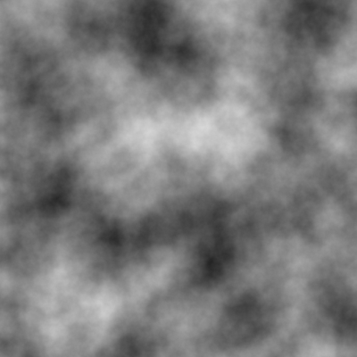
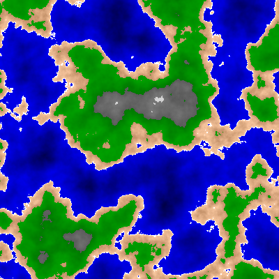

# Perlin noise terrain generator
This small demo generates a bitmap that simulates terrain using perlin noise.

 

# Compiling and running the demo
To run the demo run these commands:

make

./perlin "gridsize" "seed"

# Perlin noise
The perlin noise is generated pixel by pixel. This is done through creating
random gradients at each of the edges of a grid. Then by calculating the dotproduct
from the gradient and the current pixel, and interpolating the value the perlin
noise pixel is created. The final step is to use fractional brownian motion to get
more detailed noise. This is done through calling the perlin noise function
several times, while each time changing the x and y values by multiplying them
with a decreasing freequency. By then adding the value of each iteration to the
final value more detailed noise is created. This is done for each grid, and the 
number of grids can be changed.

# Terrain coloring
Each pixel has a value of 0-255. This can be seen as a hightmap where
the lowest value is 0 and the highest is 255. By thresholds for each type of terrain, 
the final result is generated.
